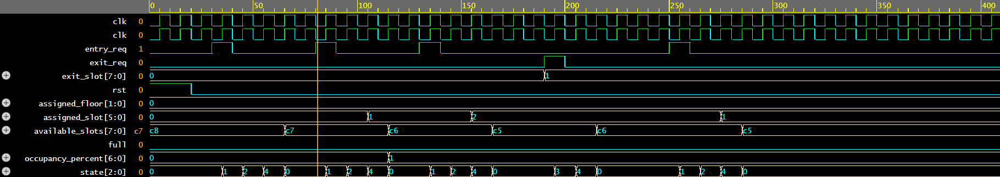
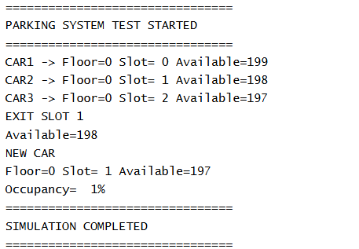

# Smart-Multi-Floor-Car-Parking-Management-System-using-Verilog-HDL
FSM-based parking management system supporting 200 parking slots across four floors with automatic slot allocation, occupancy tracking, full-capacity detection, and FPGA implementation using Verilog HDL.

## Features

- 200 Parking Slots
- 4 Floors × 50 Slots
- FSM-Based Control
- Automatic Slot Allocation
- Occupancy Monitoring
- Full Capacity Detection

## Simulation Results

## Tools Used

- Verilog HDL
- EDA Playground
- Icarus Verilog

## Future Enhancements

- UART Interface
- Seven Segment Display
- RFID Integration
- Multi-Gate Entry System
